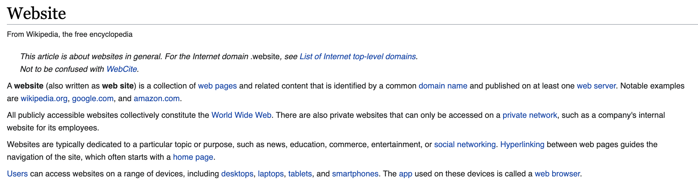

# intro-to-web-development
A quick crash course by Junior Garcia
## Outline
- What is a website?

- Client-server model

- What is a website composed of? 
A typical website, as in the content that you access with your device, is usually composed of: 
    - One or more html pages. 
    - Some styling, dictated by the Cascading Style Sheets (CSS) langauge. 
    - Some interactivity, provided by the Javascript programming Language. 
- Create your own html page
Creating an html page is all you need to make your own website. Everything you do after will be to improve your website, but is not neccessary by any means. 

How to make an html page. 
- Use a text editor of your choice (Install Visual Studio Code)
- Create a new document
- Give it a title. The usual convention is to call the page (index.html), but you can name it however you want. 
- Add some HTML code to your page. Although HTML has its set of rules, just like other programming languages, it is just a markup language. This means that the rules are made to make the process easier for several people to collaborate with each other (like us, web developers). Therefore, we should not feel intimated by these rules as they can usually be found online (Google will alway be your friend when making websites).
- Add this code to your page 
```html
<html>
    <div>
        <p>Hello World, my name is [NAME]</p>
    </div>
</html>
```
- Add your name inside the brackets.
- Done, you created your own webpage!

- Style your own html page.


- next steps